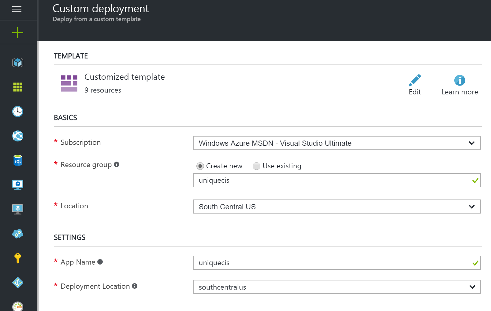

# Cortana Intelligence Workshop Prereq Deployment

This GitHub repo exists to deploy the assets needed to complete the Cortana Intelligence Workshop. We are leveraging a capability of Azure called ARM templates which allow you to specifiy what your solution looks like from a deployment perspetive simply by using JSON code. This is a fairly simple use of ARM templates, but you can actually deploy very complex topologies using this technology - straight from source control. Pretty cool!!

This particular ARM template will deploy the following resources into a new Resource Group:

* An HDInsight Spark cluster with 2 worker nodes.
* An Azure ML Workspace. After the deployment is completed, you can go to https://studio.azureml.net/ and view your workspace. You will need to sign in with the same account that you use to sign in to Azure.
* A Windows 2012 R2 VM that will act as a Lab VM where you will run the Data Factory Data Management Gateway and Power BI Desktop. This VM is basically a workstation for you so you do not have to install software on your personal/work device.
* Supporting resources - both the Spark cluster and the Lab VM need a few requisite resources in order to operate such as storage accounts, networks, a public IP, etc.

All you need to do is click the "Deploy to Azure" button below and fill out the following parameters in Azure. NOTE: you will want to be signed in to your Azure subscription before clicking the button below.

When you click the "Deploy to Azure" button, you will be taken to the Azure portal and presented with a form for a new custom deployment (which uses the ARM template in this GitHub repo). You will be presented with a blade to provide some custom parameters as shown in the screenshot below.

* **Subscription** - Select the subscription you wish to use for the workshop.
* **Resource Group** - Create a new resource group and give it a globally unique name.
* **Location** - This is the location of your Resource Group. Resouces that are deployed inside this Resource Group do *not* have to be deployed to this same location.
* **App Name** - This should be a short (10 or fewer characters), but unique string that will be a prefix to all of the resources deployed. For example, if you type in *smithcis*, your Spark cluster will be called *smithcisspark* and your Lab VM will be called *smithcislab*.
* **Deployment Location** - The default deployment location for the resources needed for the workshop. This does *not* have to be the same as the location chosen for the Resource Group.